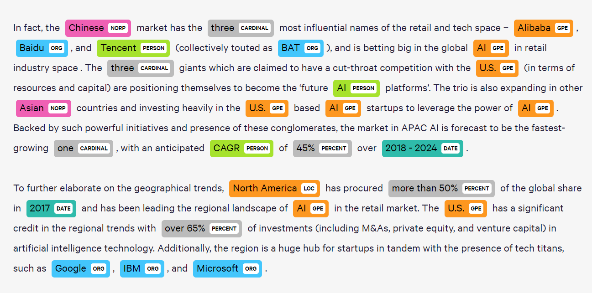
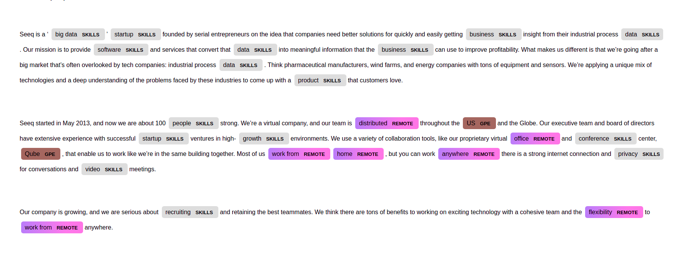
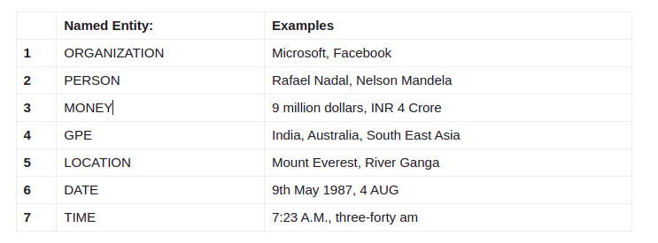

**Table of Contents**  *generated with [DocToc](https://github.com/thlorenz/doctoc)*

- [Entity Extraction](#entity-extraction)
  - [What is an NER model](#what-is-an-ner-model)
  - [What is SpaCy](#what-is-spacy)
  - [Which learning algorithm SpaCy uses](#which-learning-algorithm-spacy-uses)
  - [Fine tuning SpaCy algorithms](#fine-tuning-spacy-algorithms)
  - [What is a phrase matcher](#what-is-a-phrase-matcher)
- [How the code works](#how-the-code-works)

# Entity Extraction

 

Entity extraction, also known as entity name extraction or named entity recognition, is an information extraction technique that identifies key elements from text, then classifies them into predefined categories.This makes unstructured data machine readable (or structured) and available for standard processing actions such as retrieving information, extracting facts and answering questions.

The main goal from entity extraction in our case was to be able to highlight certain words and tag them with the name of the entity that they belong to. This way, we can optimize the time needed to check if a job is qualified to be posted or not. For example : Highlight all the locations in a text could help us determine the location of the job.

The idea here is to create a custom-made NER model.

 

## What is an NER model

 
Named Entity Recognition (NER) is an application of Natural Language Processing (NLP) that processes and understands large amounts of unstructured human language. Also known as entity identification, entity chunking and entity extraction. NER extraction is the first step in answering questions, retrieving information and topic modeling. There are many models for implementing NER depending on the application need. 
 

 

An NER System is capable of discovering entity elements from raw data and determines the category the element belongs to. The system reads the sentence and highlights the important entity elements in the text. NER might be given separate sensitive entities depending on the project. This means that NER systems designed for one project may not be reused for another task. For a general entity such as name, location, organization, date and pre-trained library, Stanford NER and Spacy can be used. But for a domain specific entity, an NER model can be trained with custom training data requires lots of human efforts and time.

Example of Spacy NER model :

 

## What is SpaCy 

 
SpaCy is an open-source software library for advanced natural language processing taks, written in Python and Cython (programming language that aims to be a superset of the Python programming language, designed to give C-like performance with code that is written mostly in Python with optional additional C-inspired syntax). 

Unlike NLTK, which is widely used for teaching and research, SpaCy focuses on providing software for production usage which was better in my case. SpaCy also supports deep learning workflows that allow connecting statistical models trained by popular machine learning libraries like TensorFlow or PyTorch which makes it a practical tool. 

SpaCy main features are : 

  - Tokenization support for over 65 languages.
  - Built-in support for trainable pipeline components such as Named entity recognition, Part-of-speech tagging, dependency parsing, Text classification, Entity Linking and more.
  - Statistical models for 17 languages.
  - Multi-task learning with pretrained transformers like BERT.
  - State-of-the-art speed and accuracy
  - Production-ready training system
  - Built-in visualizers for syntax and named entities
  - Easy model packaging, deployment and workflow management
 

## Which learning algorithm SpaCy uses

 
SpaCy has its own deep learning library called thinc  used under the hood for different NLP models.For most (if not all) tasks, spaCy uses a deep neural network based on CNN with a few tweaks. 

Specifically for Named Entity Recognition, spacy uses:
   
  - A transition based approach borrowed from shift-reduce parsers, which is described in the official documentation 

  - A framework that's called "Embed. Encode. Attend" see the description below:
      - Embed: Words are embedded using a Bloom filter, which means that word hashes are kept as keys in the embedding dictionary, instead of the word itself. This maintains a more compact embeddings dictionary, with words potentially colliding and ending up with the same vector representations.
      - Encode: List of words is encoded into a sentence matrix, to take context into account. spaCy uses CNN for encoding.
      - Attend: Decide which parts are more informative given a query, and get problem specific representations.
      - Predict: spaCy uses a multi layer perceptron for inference.

 

## Fine tuning SpaCy algorithms  
 
Theoretically, when fine-tuning a spaCy model with new entities, you have to make sure the model doesn't forget representations for previously learned entities. The best thing, if possible, is to train a model from scratch, but that was not possible due to lack of data resources of the company. Indeed to train deep learning models from scratch it takes a lot of data. 

So, what we are going to do, is that we are going to use the basic NER model found on Spacy, and add to it phrase matchers.
 

## What is a phrase matcher

 

spaCy features a rule-based matching engine, the Matcher, that operates over tokens, similar to regular expressions. The Matcher allows us to specify rules to match, which includes flags such as IS-PUNCT, IS-DIGIT, etc.
When we pass a sentence into a nlp pipeline in spacy, it returns a doc object which contains the same sentence but with attributes added to it. Each word and punctuation is treated as a token in the doc object. Say if we want to match “March 4, 2021” in a sentence, we have to specify the match pattern for each token in our string, in our case “March”, “4”, “,” “2021”.
     
  - A token whose lowercase form matches “march” eg: “march” or “March”.
  - A token whose IS-DIGIT flag is set to true. i.e, any number.
  - A token whose IS-PUNCT flag is set to true. i.e, any punctuation.
  - A token whose IS-DIGIT flag is set to true.

 A list of dictionaries should be created in which each dictionary contains the match pattern for one token.
 
 
 The phrase matcher can be used when large terminologies have to be matched. It functions the same way as the token matcher, but instead of specifying rules and patterns, we can input strings to match!
 
 
 In ourcase, we are going to create 3 entities:
    
  - One for LOCATION that is already available on NER spaCy model.
  - One REMOTE entity that we're gonna get from the phrasematcher that's going to be a list of keywords that implies that the job is remote.
  - One NOT REMOTE entity that we're gonna get from the second phrasematcher that's going to be a list of keywords that implies that the job is not remote.
 
 

# How the code works 
 

In the main of the app we find a function called enrich_description : 

Input : 
- description: a job description
- entities_to_match: list of new entities to match with keywords
- options: entities to highlight with color options

Output:
- The job description with keywords highlighted 

Results : 

PS:
- Here we added the entity SKILLS and we only highlighted the entities : GPE (from SpaCy), SKILLS, REMOTE and NOT_REMOTE ( from phrasematcher) 
- With the code available we can add or delete entities if we wanted by just changing the parameter entities_to_match, note also  that we need to provide for each entity a list of keywords to match from.
- if we want to add other entities that are available on SpaCy NER we just need to change the parameter options to include them. 

Entities available on SpaCy:

 
